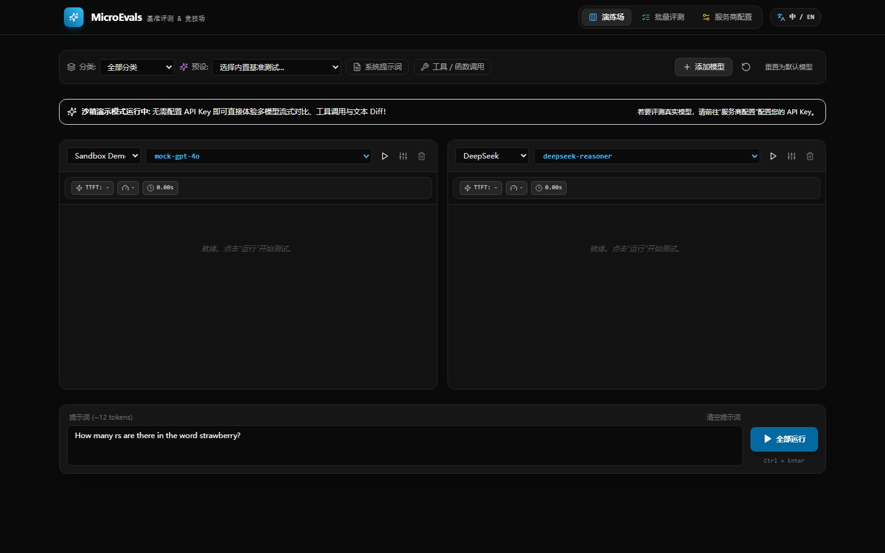
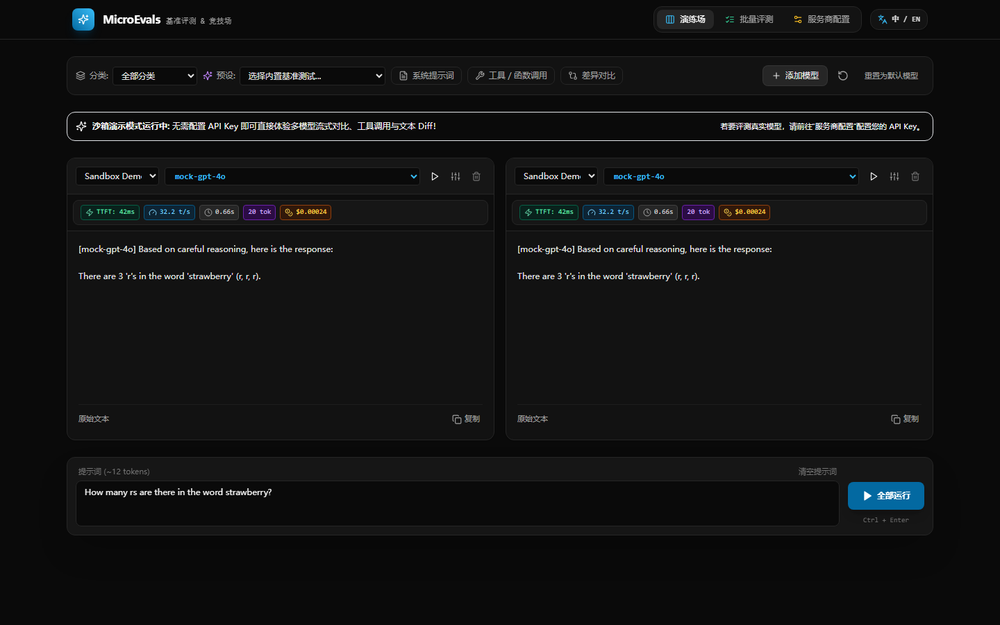
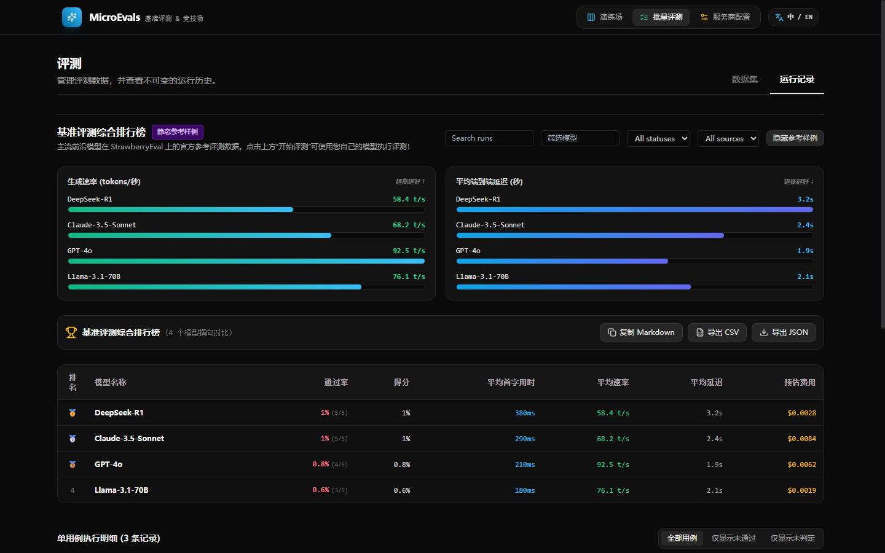
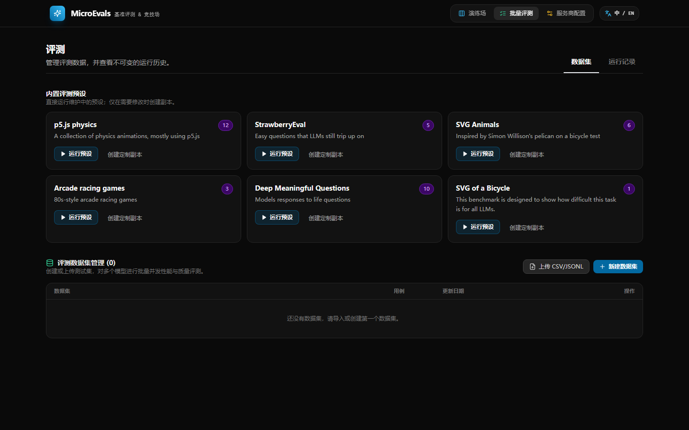
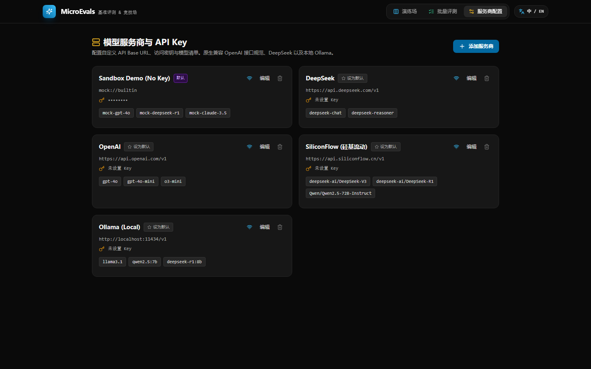

# MicroEvals 🔬

<div align="center">

**轻量、高效的大语言模型（LLM）基准评测、流式竞技场与对比测试平台**

[](LICENSE)
[](https://fastapi.tiangolo.com)
[](https://react.dev)
[](https://www.typescriptlang.org)
[](https://tailwindcss.com)

[English](README.md) • **简体中文**

[核心特性](#-核心特性) • [界面演示](#-界面截图与运行演示) • [快速启动](#-快速启动) • [项目架构](#-项目架构) • [运行测试](#-运行测试) • [许可证](#-许可证)

</div>

---

## 📖 项目简介

**MicroEvals** 是专为 AI 开发者、研究人员及工程团队打造的轻量级大模型评测与竞技平台。它支持多模型端到端实时流式并排对比，毫秒级捕捉首字延迟（TTFT）、生成速率（Tokens/s）与费用消耗，并提供多维度基准数据集批量评测、自动化判定、可视化排行榜及报表导出能力。

无需繁琐配置，平台**内置免 Key 沙箱演示模式（Sandbox Demo）**，启动即可立即体验多模型流式对比、函数调用（Tool Calling）与文本差异高亮（Diff Viewer）。

---

## ✨ 核心特性

- ⚡ **多模型流式演练场（Arena & Playground）**
  - 支持 2~4 个主流大模型并排同台竞技，一个提示词同时广播分发。
  - 支持自定义系统提示词、温度（Temperature）、Top-P、停用词等完整采样参数。
  - 支持函数调用 / 工具调用（Tool Calling / Function Calling）开关与执行结果展示。
- 📊 **毫秒级性能画像与指标监控**
  - **TTFT**（Time to First Token，首字响应耗时）
  - **TPS**（Tokens per Second，实时生成速率）
  - **总耗时**（Total Latency）与 **Token 统计**
  - **预估成本**（基于主流模型价格自动计算）
- 🔍 **智能文本差异对比（Diff Viewer）**
  - 一键切换差异高亮视图，精准比对不同模型在结构化数据、代码输出或逻辑推理上的细微分歧。
- 🏆 **批量基准评测与排行榜（Batch Evals & Leaderboard）**
  - 支持内置基准测试集（如经典 Strawberry 计数测试、逻辑推理、代码生成等）。
  - 支持自定义上传导入 CSV / JSONL 评测数据集并持久化管理。
  - 自动聚合评测指标，生成直观的多模型通过率柱状图、延迟速率对比图表与综合排行榜。
  - 支持一键导出评测报告为 Markdown、CSV 或 JSON 格式。
- 🔌 **多服务商生态原生兼容**
  - 原生支持 OpenAI API 协议规范。
  - 预置支持 **DeepSeek**（deepseek-chat / deepseek-reasoner）、**OpenAI**（GPT-4o / o3-mini 等）、**SiliconFlow（硅基流动）**、**本地 Ollama** 等。
  - 支持一键添加任意兼容 OpenAI 接口的自定义 API 服务商。
- 🌐 **双语国际化与优雅暗色主题**
  - 现代化全暗黑极客风格设计，原生支持中/英双语（i18n）即时切换。

---

## 📸 界面截图与运行演示

以下为软件启动后的实际运行界面演示与功能视图截图：

### 1. 多模型流式演练场 (Playground View)
> 支持多模型并排配置与同一提示词广播测试，内置提示词 Token 计数估算与快速重置。



---

### 2. 实时流式响应与指标监控 (Real-time Streaming & Diff Viewer)
> 双模型并行流式生成，实时计算 TTFT、生成速率 (t/s)、总用时与消耗成本，并支持文本内容差异对比 (Diff)。



---

### 3. 批量基准评测综合排行榜 (Batch Evals & Leaderboard)
> 批量运行数据集评测，可视化呈现通过率、端到端延迟与速率图表，提供排行榜总览与导出选项。



---

### 4. 内置基准预设与数据集管理 (Presets & Datasets)
> 开箱即用的预设评测用例（StrawberryEval、物理动画、SVG 生成、复杂生活问题等），支持上传自定义数据集。



---

### 5. 模型服务商与 API Key 管理 (Provider Settings)
> 统一管理各服务商 Base URL、密钥与可用模型列表，支持在线连通性检测与默认服务商切换。



---

## 🚀 快速启动

### 环境要求

- **Node.js** >= 18.0.0
- **pnpm** >= 9.0.0
- **Python** >= 3.10
- **uv**（推荐）或 pip

### 1. 克隆代码库与安装依赖

```bash
# 克隆代码库
git clone https://github.com/hydrz/microevals.git
cd microevals

# 安装前端依赖
pnpm install

# 创建并激活 Python 虚拟环境（推荐使用 uv）
uv venv
# Windows 激活虚拟环境
.\.venv\Scripts\activate
# Linux/macOS 激活虚拟环境
# source .venv/bin/activate

# 可编辑模式安装后端核心库与服务
uv pip install -e "packages/core" -e "packages/cli" -e "apps/api"
```

### 2. 一键启动前后端服务

在项目根目录执行以下命令，将通过 `concurrently` 同时启动后端 API 与前端 Vite 开发服务器：

```bash
pnpm dev
```

终端将输出服务地址：
- 🖥️ **前端 Web 界面**：`http://localhost:5173`
- ⚙️ **后端 API 服务**：`http://localhost:8000`
- 📚 **API 交互文档 (Swagger)**：`http://localhost:8000/docs`

> **提示**：也可以单独启动指定服务：
> ```bash
> # 仅启动后端 API
> pnpm dev:api
> 
> # 仅启动前端应用
> pnpm dev:web
> ```

---

## 🏗️ 项目架构

本项目采用现代化 **Monorepo** 结构，分为前端应用、后端服务、核心评测库与命令行工具：

```
microevals/
├── apps/
│   ├── api/                 # FastAPI 后端应用
│   │   ├── app/api/         # 路由层 (Playground, Evals, Providers, Presets, Datasets)
│   │   ├── app/core/        # 数据库、配置与迁移管理
│   │   ├── app/models/      # SQLAlchemy 数据实体模型
│   │   └── app/main.py      # 服务主入口
│   │
│   └── web/                 # React 18 + Vite 前端应用
│       ├── src/components/  # UI 组件 (Playground, Evals, Analytics, Settings)
│       ├── src/hooks/       # 自定义 Hook (SSE 流式连接等)
│       ├── src/i18n/        # 双语国际化配置 (中/英)
│       ├── src/services/    # 前端 API 封装
│       └── src/App.tsx      # 前端应用入口
│
├── packages/
│   ├── core/                # 核心评测与模型运行引擎
│   │   ├── microevals_core/
│   │   │   ├── agent_sandbox/  # 沙箱工具与函数调用定义
│   │   │   ├── runner/         # OpenAI 兼容流式执行器与指标统计
│   │   │   └── assertions/     # 自动化判定与打分引擎
│   │
│   └── cli/                 # MicroEvals 命令行工具
│       └── microevals_cli/  # 支持终端执行批量测试与导出
│
├── docs/
│   ├── agents/              # AI Agent 规则与配置说明
│   └── images/              # 软件运行演示截图
├── package.json             # Monorepo 根配置与脚本
├── pyproject.toml           # Python 工作区与依赖配置
└── pnpm-workspace.yaml      # pnpm 多包工作区定义
```

---

## 🧪 运行测试

运行全套单元测试与集成测试：

```bash
pnpm test
```

或使用 pytest 直接执行：

```bash
.\.venv\Scripts\python -m pytest packages/core/tests packages/cli/tests apps/api/tests
```

---

## 📄 许可证

本项目采用 [MIT License](LICENSE) 开源许可证。
